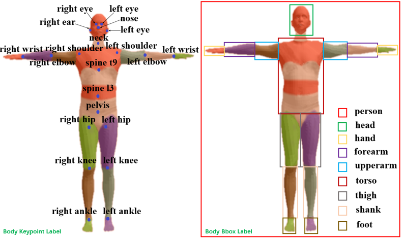

# AVAF
We propose an automatic video analysis framework for exposure region recognition in X-ray examination. In this work, we have constructed a large dataset including body keypoint and body Bbox annotation images. Currently, we are further expanding the annotation categories of the basic version dataset and transforming data format so that it can be accessed more conveniently and quickly. Soon, We will open access for the final version dataset and paper. 
# Dataset
Before the dataset expansion is complete, the dataset will not open access and if you need basic version dataset for academic research, please send us a email for getting it.
## Basic Version Annotation

## Annotion Demo
