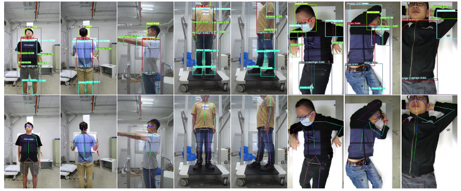
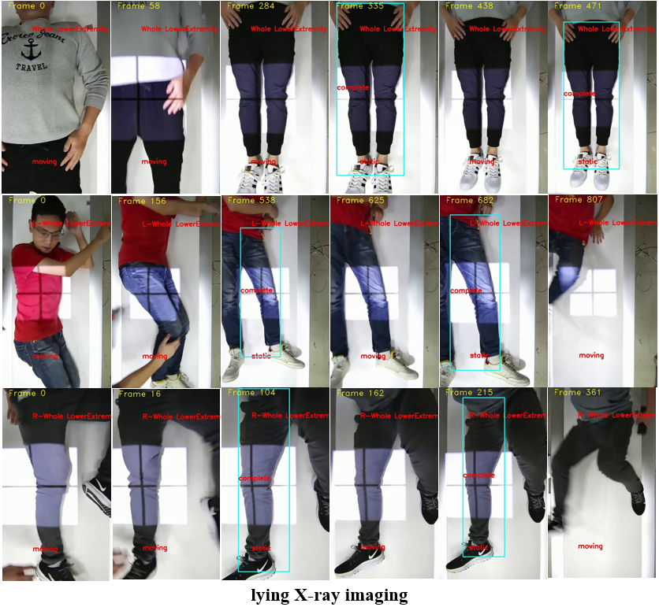

# Automatic video analysis framework for exposure region recognition in X-ray examination
We propose an automatic video analysis framework (AVAF) for exposure region recognition in X-ray examination. In this work, we have constructed a large dataset including body keypoint and body Bbox annotation images. Currently, we are further expanding the annotation categories of the basic version dataset and transforming data format so that it can be accessed more conveniently and quickly. Soon, We will open access for the final version dataset and paper. 
# Dataset
Before the dataset expansion is complete, the dataset will not open access and if you need basic version dataset for academic research, please send us a email for getting it. The following are some samples in basic version dataset.
## Annotation categories

## Annotion Demo

# Results
In the paper, we conduct extensive experiments to test the performance of the proposed method. We present qualitative visualization results of Body Structure Detection and video detection. Among them, Body Structure Detection gives the performance evaluation of the two body detection models, and video detection is used to evaluate the overall performance of the proposed framwork.
## Result of Body Structure Detection

## Result of video detection

